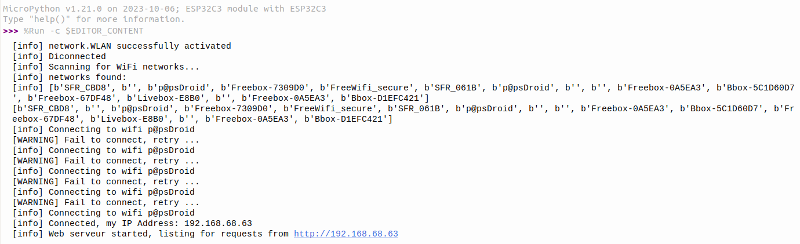
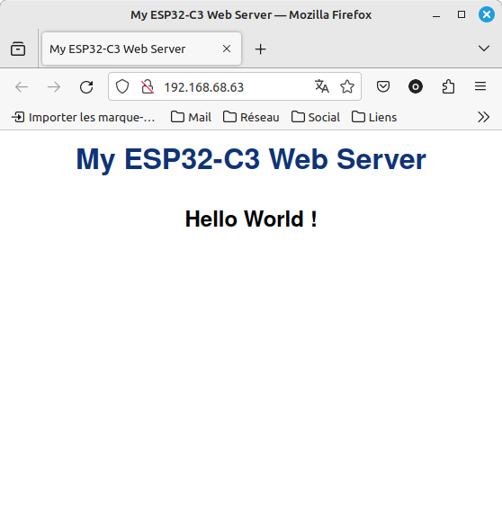

# ESP32 WEB SERVEUR

Ce module micropython permet de mettre en place un serveur WEB sur un ESP32-C3 équipé d'une LED RGB comme une [PYBSTICK-ESP32-C3](https://papsdroidfr.github.io/configuration/Pybstick-C3/).
Je me suis inspiré de [cet article](https://randomnerdtutorials.com/esp32-esp8266-micropython-web-server/) qui explique comment écrire un script pour allumer ou éteindre une led via une page HTML.

## Software
Il faut importer tout le **module web** à la racine de son ESP32-C3: créer le dossier **\web** et y importer tous les programmes du module.
* \__init__.py: initialisation du module
* config.py: variables globales utilisées par le module
* log.py: gestion des messages
* RGBLed.py: gestion de la led RGB qui par défaut est sur la pin 8 de l'ESP32.
* serveur.py: gestion du serveur web avec une page HTML par défaut "hello world"
* wifi.py: gestion du WIFI.

##  Usage
Il faut dans un premier temps configurer la connection au WIFI dans **web/config.py**.
Je vous encourage à déclarer un wifi invité sur votre box pour éviter d'utiliser le mot de passe de votre wifi privé.

la classe Serveur doit être initialisée avec 3 variables:
* une intance de la classe **Wifi**
* une fonction **gen-html()** qui génère le code HTML affiché de manière dynamique pour pouvoir afficher des informations captées par l'ESP32
* une fonction **exec_esp32(request)** qui va faire éxécuter des actions à l'ESP32 (commme allumer ou éteindre une LED) en fonction du paramètre request (string) passé. Cette fonction va rechercher des mots clés dans la request reçue (le format est "GET /?xxxxx" pour décider quelle action entreprendre. On peut imaginer ainsi pouvoir commander des moteurs, des leds etc ... 

Lors de la connection wifi, la led va avoir plusieurs status et des messages sont affichés dans la console:
* **bleu clignotant**: connection wifi en cours
* **vert**: connection wifi établie
* **rouge**: connexion wifi refusée ou inexistante.

Quand le serveur web est démarré, son adresse est affichée:


## Exemples

Ce 1er programme va générer une page HTML qui affiche "hello world": c'est le programme gen-html() par défaut utilisé par le module quand on ne lui spécifie rien. 

```python
from web.wifi import Wifi
from web.serveur import Serveur

#connection to my WIFI_SSID defined into web.config
my_wifi = Wifi()
print(my_wifi.scan_networks())
while not my_wifi.is_connected:
    my_wifi.connect()

#start web serveur
my_serveur = Serveur(wifi=my_wifi)
```



Ce second programme va générer une page HTML avec deux boutons de commande pour allumer et étteindre la LED de l'ESP32. 
Cette fois-ci nous définissons le générateur de code HTML avec la fonction **def my_html_page()** et les actions en réponse de l'ESP32 sont définies dans la fonction **def my_exec_request(request)** qui sont toutes deux passées en paramètre lors de la création de la variable my_serveur = Serveur(wifi=my_wifi, gen_html=my_html_page, exec_esp32 = my_exec_request)

```python
from web.wifi import Wifi
from web.serveur import Serveur
from web.config import LED
import time

#connection to my WIFI_SSID defined into web.config
my_wifi = Wifi()
print(my_wifi.scan_networks())
while not my_wifi.is_connected:
    my_wifi.connect()
    time.sleep(0.5)

def my_html_page() -> str:
      if LED.is_on:
        led_state="ON"
      else:
        led_state="OFF"
  
      html = """
        <html>
            <head>
                <title>ESP32-C3 Web Server</title> <meta name="viewport" content="width=device-width, initial-scale=1">
                <link rel="icon" href="data:,">
                <style>html{font-family: Helvetica; display:inline-block; margin: 0px auto; text-align: center;}
                    h1{color: #0F3376; padding: 2vh;}
                    p{font-size: 1.5rem;}
                    .button{display: inline-block; background-color: #e7bd3b; border: none; 
                        border-radius: 4px; color: white;padding: 16px 40px; text-decoration: none; font-size: 30px; margin: 2px; cursor: pointer;}
                    .button2{background-color: #4286f4;}
                </style>
            </head>
        
            <body>
                <h1>ESP32-C3 Web Server</h1> 
                <p>Led state: <strong>""" + led_state + """</strong></p>
                <p><a href="/?led=on"><button class="button">ON</button></a></p>
                <p><a href="/?led=off"><button class="button button2">OFF</button></a></p>
            </body>
        </html>
        """
      return html

def my_exec_request(request:str) ->None:
    if request.find('GET /?led=on') > -1:
        LED.color((32,0,0)) #green color
    elif request.find('GET /?led=off') > -1:
        LED.off()  

#start web serveur
my_serveur = Serveur(wifi=my_wifi, gen_html=my_html_page, exec_esp32 = my_exec_request)
```
